<p align="center">
  <strong>milens</strong><br>
  <em>Code Intelligence Engine for AI Agents</em>
</p>

<p align="center">
  <a href="https://www.npmjs.com/package/milens"></a>
  <a href="https://github.com/fuze210699/milens/blob/develop/LICENSE"></a>
  <a href="https://nodejs.org">= 20"></a>
  
  
</p>

<p align="center">
  <strong>Index any codebase → Knowledge graph → AI agents that never miss code</strong>
</p>

<p align="center">
  <a href="#the-problem">Why?</a> •
  <a href="#quick-start">Quick Start</a> •
  <a href="#cli-commands">CLI Commands</a> •
  <a href="#mcp-tools">MCP Tools</a> •
  <a href="#editor-setup">Editors</a> •
  <a href="#supported-languages">Languages</a>
</p>

---

## The Problem

You're burning tokens and premium requests on tasks that milens can handle at a fraction of the cost. Every time your agent explores a codebase — reading files one by one, searching for references, tracing call chains — you're paying for what a pre-built knowledge graph delivers instantly.

**Why not let milens save your wallet?**

One `milens analyze` replaces dozens of agent tool calls. Instead of the agent spending 10+ steps to map out a function's dependencies, `impact()` returns the full blast radius in a single call.

If you're concerned about security, read our [Security & Privacy](#security--privacy) guarantees — milens is fully offline, zero telemetry, localhost-only.

### How milens Solves This

<p align="center">
  
</p>

milens builds a **pre-indexed knowledge graph** at analysis time — resolving every import, call, and inheritance chain — so that any tool query returns the full dependency picture instantly, without multi-step exploration.

---

## Quick Start

```bash
npx milens analyze                          # index your codebase
```

Then add the MCP server to your editor ([setup below](#editor-setup)) and your agent immediately gets 19 code intelligence tools.

---

## CLI Commands

### `milens analyze` — Index a codebase

Parse all source files, resolve cross-file dependencies, and build a searchable knowledge graph.

```bash
milens analyze                              # index current directory
milens analyze -p /path/to/repo             # index a specific repo
milens analyze -p . --force                 # full re-index (ignore cache)
milens analyze -p . --force --verbose       # full re-index with detailed progress
```

**Output:** A `.milens/milens.db` SQLite database containing every symbol, relationship, and search index.

**Incremental mode:** By default, only re-parses files whose SHA-256 hash has changed since the last run.

#### Generating AI skill files

Skill files teach your AI agent the codebase structure — key symbols, entry points, cross-area dependencies — without reading every file.

```bash
milens analyze -p . --skills                # generate for all editors
milens analyze -p . --skills-copilot        # GitHub Copilot only
milens analyze -p . --skills-cursor         # Cursor only
milens analyze -p . --skills-claude         # Claude Code only
milens analyze -p . --skills-agents         # AGENTS.md only
milens analyze -p . --skills-windsurf       # Windsurf only
```

| Flag | Output files |
|---|---|
| `--skills-copilot` | `.github/instructions/*.instructions.md` + `.github/copilot-instructions.md` |
| `--skills-cursor` | `.cursor/rules/*.mdc` + `.cursor/index.mdc` |
| `--skills-claude` | `.claude/skills/generated/*/SKILL.md` + `.claude/rules/*.md` + `CLAUDE.md` |
| `--skills-agents` | `.agents/skills/*/SKILL.md` + `AGENTS.md` |
| `--skills-windsurf` | `.windsurfrules` |

> Root config files use `<!-- milens:start/end -->` markers for **idempotent injection** — re-running replaces the milens section without overwriting your custom content.

---

### `milens search` — Find symbols by name

Full-text search (BM25) across all indexed symbol names and file paths.

```bash
milens search "UserService"                 # search for symbols
milens search "auth" --limit 50             # increase result limit (default: 20)
milens search "handler" -p /path/to/repo    # search in a specific repo
```

**Output format:** `name [kind] file:line (exported)`

```
AuthService [class] src/auth.ts:15 (exported)
hashPassword [function] src/auth.ts:3 (exported)
```

---

### `milens inspect` — 360° symbol view

Show everything about a symbol: who calls it (incoming) and what it depends on (outgoing).

```bash
milens inspect "AuthService"
milens inspect "resolveLinks" -p .
```

**Output:**

```
AuthService [class] src/auth.ts:15
  incoming:
    calls: handleLogin (src/routes.ts)
    calls: UserController (src/controllers/user.ts)
  outgoing:
    imports: User (src/models.ts)
    calls: hashPassword (src/auth.ts)
    calls: createUser (src/models.ts)
```

---

### `milens impact` — Blast radius analysis

Recursively trace what depends on a symbol (upstream) or what a symbol depends on (downstream).

```bash
milens impact "createUser"                  # upstream: what breaks if this changes?
milens impact "UserModel" -d downstream     # downstream: what does this depend on?
milens impact "searchSymbols" --depth 2     # limit traversal depth (default: 3)
```

**Output:**

```
TARGET: createUser [function] src/models.ts:42
  [depth 1] AuthService [class] src/auth.ts:15 (calls)
  [depth 1] UserController [class] src/controllers/user.ts:8 (calls)
  [depth 2] handleLogin [function] src/routes.ts:23 (calls)
```

**Depth meaning:**
- Depth 1 = **WILL BREAK** — direct callers/dependents
- Depth 2 = **LIKELY AFFECTED** — indirect dependents
- Depth 3 = **MAY NEED TESTING** — transitive dependents

---

### `milens serve` — Start MCP server

Expose the knowledge graph to AI agents via the Model Context Protocol.

```bash
milens serve                                # stdio transport (for editors)
milens serve -p /path/to/repo               # serve a specific repo
milens serve --http                         # HTTP transport on port 3100
milens serve --http --port 8080             # HTTP on custom port
```

**stdio mode** (default): Used by editors like VS Code, Cursor, and Claude Code. The agent communicates through stdin/stdout.

**HTTP mode**: Used by remote agents or custom integrations. Binds to `127.0.0.1` only — no network exposure.

Endpoint: `POST http://localhost:3100/mcp`

---

### `milens status` — Show index stats

```bash
milens status                               # current directory
milens status -p /path/to/repo              # specific repo
```

**Output:**

```
Repository: /home/user/my-project
Database:   /home/user/my-project/.milens/milens.db
Indexed:    2026-04-11T10:30:00Z
Symbols:    210
Links:      348
Files:      30
```

---

### `milens list` — List all indexed repositories

```bash
milens list
```

**Output:**

```
3 indexed repositories:

  /home/user/project-a
    DB:      /home/user/project-a/.milens/milens.db
    Indexed: 2026-04-11T10:30:00Z

  /home/user/project-b
    DB:      /home/user/project-b/.milens/milens.db
    Indexed: 2026-04-10T15:22:00Z
```

---

### `milens clean` — Remove index

```bash
milens clean                                # remove index for current directory
milens clean -p /path/to/repo               # remove index for specific repo
milens clean --all                          # remove ALL indexes
```

---

### `milens dashboard` — Usage analytics

Open a browser-based dashboard showing tool usage statistics, token savings, and response times.

```bash
milens dashboard                            # open on port 3200
milens dashboard --port 8080                # custom port
```

---

## MCP Tools

When the MCP server is running, your AI agent gets these 19 tools:

### Search & Navigate

| Tool | What It Does | Example |
|---|---|---|
| `query` | Symbol search (FTS5 full-text) | `query({query: "UserService"})` |
| `grep` | Text search ALL files — code, templates, configs, docs | `grep({pattern: "TODO", scope: "all"})` |
| `context` | 360° symbol view — incoming refs + outgoing deps | `context({name: "AuthService"})` |
| `get_file_symbols` | All symbols in a file with ref/dep counts | `get_file_symbols({file: "src/auth.ts"})` |
| `get_type_hierarchy` | Inheritance/implementation tree | `get_type_hierarchy({name: "BaseController"})` |

### Impact & Safety

| Tool | What It Does | Example |
|---|---|---|
| `impact` | Blast radius: what breaks if this changes? | `impact({target: "createUser"})` |
| `edit_check` | Pre-edit safety: callers + exports + test coverage + ⚠ warnings | `edit_check({name: "resolveLinks"})` |
| `detect_changes` | Git diff → affected symbols + direct dependents | `detect_changes({})` |
| `find_dead_code` | Exported symbols with zero references | `find_dead_code({})` |

### Understanding

| Tool | What It Does | Example |
|---|---|---|
| `smart_context` | Intent-aware context: `understand`/`edit`/`debug`/`test` | `smart_context({name: "analyze", intent: "edit"})` |
| `trace` | Execution flow: call chains to/from entrypoints | `trace({to: "searchSymbols"})` |
| `routes` | Detect framework routes/endpoints | `routes({})` |
| `explain_relationship` | Shortest path between two symbols | `explain_relationship({from: "A", to: "B"})` |
| `overview` | Combined context + impact + grep in ONE call | `overview({name: "Database"})` |

### Codebase Overview

| Tool | What It Does | Example |
|---|---|---|
| `domains` | Domain clusters — groups of files forming logical modules | `domains({})` |
| `repos` | List all indexed repositories | `repos({})` |
| `status` | Index stats, domains, test coverage, staleness | `status({})` |

### Resources & Prompts

**4 Resources:** `milens://overview`, `milens://symbol/{name}`, `milens://file/{path}`, `milens://domain/{name}`

**3 Guided Prompts:** `delete-feature`, `refactor-symbol`, `explore-symbol` — each triggers a multi-step workflow using the tools above.

---

## Editor Setup

### VS Code / GitHub Copilot

```bash
npx milens analyze -p .                     # index your repo (run once)
```

Add to `.vscode/mcp.json`:

```json
{
  "servers": {
    "milens": {
      "type": "stdio",
      "command": "npx",
      "args": ["-y", "milens", "serve", "-p", "${workspaceFolder}"]
    }
  }
}
```

<details>
<summary><strong>Other Editors</strong></summary>

#### Cursor

Add to `.cursor/mcp.json`:

```json
{
  "mcpServers": {
    "milens": {
      "command": "npx",
      "args": ["-y", "milens", "serve", "-p", "."]
    }
  }
}
```

#### Claude Code

```bash
claude mcp add milens -- npx -y milens serve -p .
```

#### Windsurf

Add to `~/.codeium/windsurf/mcp_config.json`:

```json
{
  "mcpServers": {
    "milens": {
      "command": "npx",
      "args": ["-y", "milens", "serve", "-p", "."]
    }
  }
}
```

#### Codex

Add to `.codex/config.toml`:

```toml
[mcp_servers.milens]
command = "npx"
args = ["-y", "milens", "serve", "-p", "."]
```

</details>

---

## Supported Languages

| Language | Extensions | Imports | Calls | Heritage | Frameworks |
|---|---|---|---|---|---|
| TypeScript | `.ts` `.tsx` | ✓ ESM + require | ✓ + decorators | ✓ extends/implements | NestJS, React JSX |
| JavaScript | `.js` `.jsx` `.mjs` `.cjs` | ✓ ESM + require | ✓ | ✓ | React JSX, Express |
| Python | `.py` | ✓ | ✓ + decorators | ✓ | FastAPI, Flask |
| Java | `.java` | ✓ + static | ✓ + annotations, new | ✓ | Spring |
| Go | `.go` | ✓ | ✓ | — | net/http |
| Rust | `.rs` | ✓ | ✓ + macros | ✓ | — |
| PHP | `.php` | ✓ + include | ✓ + static, new | ✓ + traits | Laravel |
| Ruby | `.rb` | ✓ | ✓ | ✓ | Rails |
| Vue | `.vue` | ✓ | ✓ template refs | ✓ | Vue 3 SFC |
| HTML | `.html` `.htm` | ✓ `<script src>` `<link>` | ✓ inline `<script>` | — | — |
| CSS | `.css` | ✓ `@import` | — | — | Custom properties |
| Markdown | `.md` `.mdx` | ✓ local `[links]()` | — | — | Headings → section symbols, parent-child hierarchy |

---

## Architecture

<p align="center">
  
</p>

### How it works

1. **Scan** — find all source files matching supported extensions
2. **Parse** — tree-sitter extracts symbols (functions, classes, methods, etc.) and raw references (imports, calls, extends)
3. **Resolve** — cross-file link resolution: match import paths to files, match call names to symbol definitions
4. **Enrich** — compute roles (entrypoint/hub/utility/leaf), heat scores, domain clusters
5. **Persist** — store everything in SQLite with FTS5 search and recursive CTEs for graph traversal

### Multi-Repo

milens uses a global registry (`~/.milens/`) — one MCP server serves all indexed repos. Pass `repo` to target a specific one when multiple are registered.

<p align="center">
  
</p>

### Design Decisions

| Decision | Rationale |
|---|---|
| **Declarative LangSpec** | Each language = 1 config object with tree-sitter queries. One universal extractor for all 12 languages |
| **SQLite + recursive CTE** | Impact analysis runs entirely in the database — no full graph in memory |
| **Token-compact output** | `name [kind] file:line` format — saves 40-60% tokens for AI |
| **Incremental by hash** | SHA-256 file hashing — only changed files get re-parsed |
| **Localhost-only HTTP** | Binds `127.0.0.1` — no network exposure without explicit intent |

---

## Security & Privacy

milens is **offline by design** — zero network calls, zero telemetry.

| Layer | Protection |
|---|---|
| **Data locality** | Index lives in `.milens/` per repo (gitignored). No source code stored in registry |
| **HTTP transport** | Binds to `127.0.0.1` only — requires explicit `--http` flag |
| **User-supplied regex** | Validated against ReDoS patterns |
| **FTS5 queries** | Each token quoted as a literal — no query injection |
| **File access** | All reads bounded to the repo root — no path traversal |
| **Git integration** | `execFileSync` with argument arrays — no shell interpolation |

---

## Development

```bash
npm install              # install dependencies
npm run build            # tsc → dist/
npm test                 # vitest (55 tests)
npm run lint             # tsc --noEmit
npm run self-analyze     # index this repo
npm run self-serve       # start MCP server on port 3100
```

---

## License

[PolyForm Noncommercial 1.0.0](LICENSE)

Architectural inspiration from [GitNexus](https://github.com/abhigyanpatwari/GitNexus) by Abhigyan Patwari.
