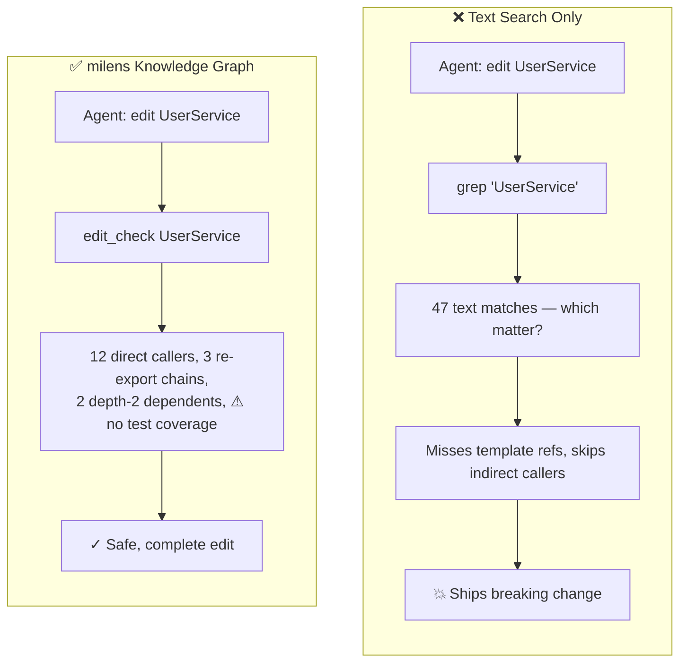
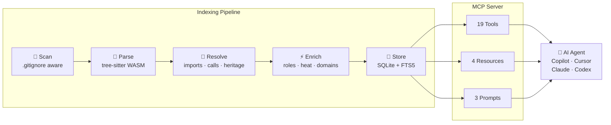
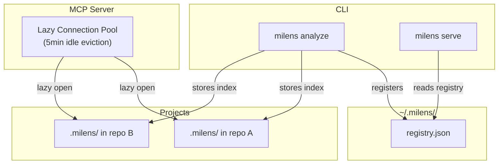

<p align="center">
  <strong>milens</strong><br>
  <em>Code Intelligence Engine for AI Agents</em>
</p>

<p align="center">
  <a href="https://www.npmjs.com/package/milens"></a>
  <a href="https://github.com/fuze210699/milens/blob/develop/LICENSE"></a>
  <a href="https://nodejs.org">= 20"></a>
  
  
</p>

<p align="center">
  <strong>Index any codebase → Knowledge graph → AI agents that never miss code</strong>
</p>

<p align="center">
  <a href="#the-problem">Why?</a> •
  <a href="#quick-start">Quick Start</a> •
  <a href="#what-your-ai-agent-gets">Agent Tools</a> •
  <a href="#editor-setup">Editors</a> •
  <a href="#supported-languages">Languages</a> •
  <a href="#architecture">Architecture</a>
</p>

---

## The Problem

AI coding agents (**Copilot**, **Cursor**, **Claude Code**, **Codex**, **Windsurf**) are powerful — but they navigate your codebase by **text search alone**. They don't know the dependency graph.

**What happens:**

1. Agent edits `UserService.validate()`
2. Doesn't know 12 functions depend on its return type
3. **Breaking changes ship**

### Text Search vs Knowledge Graph



**milens precomputes structure at index time** — every dependency, call chain, and domain cluster — so tools return complete context in **one call**, not a 10-query chain.

---

## Quick Start

**2 commands. That's it.**

```bash
npx milens analyze                          # index your codebase
npx milens analyze --skills                 # + generate AI skill files
```

Then add the MCP server to your editor ([setup below](#editor-setup)) and your agent immediately gets 19 tools + 4 resources + 3 prompts — with built-in instructions that teach it how to use them.

> **No config files needed.** milens sends tool usage guidance via the MCP protocol `initialize` response — every connected agent automatically learns the workflows.

---

## What Your AI Agent Gets

### 19 MCP Tools

| Tool | What It Does |
|---|---|
| **Search & Navigate** | |
| `query` | Symbol search (FTS5 full-text) |
| `grep` | Text search ALL files — templates, SCSS, configs, docs. Scoped: `all`, `code`, `imports`, `definitions` |
| `context` | 360° symbol view — incoming refs + outgoing deps |
| `get_file_symbols` | All symbols in a file with ref/dep counts |
| `get_type_hierarchy` | Inheritance/implementation tree |
| **Impact & Safety** | |
| `impact` | Blast radius: what breaks if this changes? Depth-grouped |
| `edit_check` | Pre-edit safety: callers + exports + re-export chains + test coverage + ⚠ warnings |
| `detect_changes` | `git diff` → affected symbols + direct dependents |
| `find_dead_code` | Exported symbols with zero references |
| **Understanding** | |
| `smart_context` | Intent-aware context: `understand` / `edit` / `debug` / `test` — returns only what matters |
| `trace` | Execution flow: call chains from entrypoints to a target (or downstream) |
| `routes` | Detect framework routes/endpoints (Express, FastAPI, NestJS, Flask, Go, PHP, Rails) |
| `explain_relationship` | Shortest dependency path between two symbols |
| **Codebase Overview** | |
| `overview` | Combined context + impact + grep in ONE call (saves 2-3 round trips) |
| `domains` | Domain clusters — groups of files forming logical modules |
| `repos` | List all indexed repositories with summary stats |
| `status` | Index stats, domains, test coverage, staleness |

### 4 MCP Resources

| Resource | What It Returns |
|---|---|
| `milens://overview` | Index overview: stats, domains, coverage, staleness |
| `milens://symbol/{name}` | Symbol definition + relationships |
| `milens://file/{path}` | All symbols in a file |
| `milens://domain/{name}` | Domain cluster details |

### 3 Guided Prompts

| Prompt | Workflow |
|---|---|
| `delete-feature` | grep → impact → context → full deletion plan |
| `refactor-symbol` | context → impact → grep → hierarchy → every file to update |
| `explore-symbol` | query → context → impact (both directions) → grep → summary |

### Built-in Agent Instructions

The MCP server sends **tool usage guidance** on every `initialize` — agents automatically learn:

- When to combine `impact` + `grep` (code deps + text references)
- Pre-edit workflow (`edit_check` or `smart_context intent=edit`)
- `query` for code identifiers vs `grep` for display text
- Impact depth meaning: 1 = WILL BREAK, 2 = LIKELY AFFECTED, 3 = MAY NEED TESTING
- ⚠ unresolved markers vs ✓ external (expected) classification

---

## Editor Setup

### VS Code / GitHub Copilot (recommended)

```bash
npx milens analyze -p .                     # index your repo (run once)
```

Add to `.vscode/mcp.json`:

```json
{
  "servers": {
    "milens": {
      "type": "stdio",
      "command": "npx",
      "args": ["-y", "milens", "serve", "-p", "${workspaceFolder}"]
    }
  }
}
```

**Done.** Copilot now has access to 19 code intelligence tools.

<details>
<summary><strong>Other Editors</strong></summary>

#### Cursor

Add to `.cursor/mcp.json`:

```json
{
  "mcpServers": {
    "milens": {
      "command": "npx",
      "args": ["-y", "milens", "serve", "-p", "."]
    }
  }
}
```

#### Claude Code

```bash
claude mcp add milens -- npx -y milens serve -p .
```

#### Windsurf

Add to `~/.codeium/windsurf/mcp_config.json`:

```json
{
  "mcpServers": {
    "milens": {
      "command": "npx",
      "args": ["-y", "milens", "serve", "-p", "."]
    }
  }
}
```

#### Codex

Add to `.codex/config.toml`:

```toml
[mcp_servers.milens]
command = "npx"
args = ["-y", "milens", "serve", "-p", "."]
```

#### HTTP Mode (remote agents)

```bash
npx milens serve --http --port 3100         # localhost only, no auth needed
```

Endpoint: `POST http://localhost:3100/mcp`

</details>

---

## Skills Generation

Generate editor-specific context files from your knowledge graph:

```bash
npx milens analyze -p . --skills            # all editors at once
npx milens analyze -p . --skills-copilot    # GitHub Copilot only
npx milens analyze -p . --skills-cursor     # Cursor only
npx milens analyze -p . --skills-claude     # Claude Code only
npx milens analyze -p . --skills-agents     # AGENTS.md only
npx milens analyze -p . --skills-windsurf   # Windsurf only
```

This generates per-area skill files with: key symbols, entry points, cross-area dependencies, and **MCP tool usage instructions** — so agents know both the codebase structure and how to use milens tools.

| Output Path | Editor |
|---|---|
| `.github/instructions/*.instructions.md` + `.github/copilot-instructions.md` | GitHub Copilot |
| `.cursor/rules/*.mdc` + `.cursor/index.mdc` | Cursor |
| `.claude/skills/generated/*/SKILL.md` + `.claude/rules/*.md` + `CLAUDE.md` | Claude Code |
| `.agents/skills/*/SKILL.md` + `AGENTS.md` | 40+ agents |
| `.windsurfrules` | Windsurf |

> Root config files use `<!-- milens:start/end -->` markers for **idempotent injection** — re-running replaces the milens section without overwriting your custom content.

---

## CLI Commands

```bash
# ── Index & Explore ──
npx milens analyze -p .                     # index current directory
npx milens analyze -p . --force --verbose   # full re-index with progress
npx milens search "UserService"             # search symbols (FTS5)
npx milens inspect "AuthService"            # 360° view: refs + deps

# ── Impact Analysis ──
npx milens impact "createUser"              # what breaks if this changes?
npx milens impact "UserModel" -d downstream # what does this depend on?

# ── MCP Server ──
npx milens serve -p .                       # stdio (for editors)
npx milens serve --http --port 3100         # HTTP (for remote agents)

# ── Management ──
npx milens status -p .                      # index stats
npx milens list                             # all indexed repos
npx milens clean -p .                       # remove index
npx milens clean --all                      # remove all indexes
```

---

## Supported Languages

| Language | Extensions | Imports | Calls | Heritage | Frameworks |
|---|---|---|---|---|---|
| TypeScript | `.ts` `.tsx` | ✓ ESM + require | ✓ + decorators | ✓ extends/implements | NestJS, React JSX |
| JavaScript | `.js` `.jsx` `.mjs` `.cjs` | ✓ ESM + require | ✓ | ✓ | React JSX, Express |
| Python | `.py` | ✓ | ✓ + decorators | ✓ | FastAPI, Flask |
| Java | `.java` | ✓ + static | ✓ + annotations, new | ✓ | Spring |
| Go | `.go` | ✓ | ✓ | — | net/http |
| Rust | `.rs` | ✓ | ✓ + macros | ✓ | — |
| PHP | `.php` | ✓ + include | ✓ + static, new | ✓ + traits | Laravel |
| Ruby | `.rb` | ✓ | ✓ | ✓ | Rails |
| Vue | `.vue` | ✓ | ✓ template refs | ✓ | Vue 3 SFC |

---

## Architecture



### Multi-Repo Architecture

milens uses a **global registry** — one MCP server serves all indexed repos. No per-project server config needed.



> When only one repo is indexed, the `repo` parameter is optional on all tools.

### Design Decisions

| Decision | Rationale |
|---|---|
| **Declarative LangSpec** | Each language = 1 config object with tree-sitter queries. One universal extractor for all 9 languages |
| **SQLite + recursive CTE** | Impact analysis runs entirely in the database — no full graph in memory |
| **Token-compact output** | `name [kind] file:line` format — saves 40-60% tokens for AI |
| **Incremental by hash** | SHA-256 file hashing — only changed files get re-parsed |
| **Union-Find domains** | Graph-based clustering (files with ≥2 mutual links = same domain) — smarter than directory-based |
| **External-aware resolution** | Separates internal unresolved (⚠ data quality) from external packages (✓ expected) |
| **Lazy DB pools** | Connections opened on demand, evicted after 5min idle |
| **Localhost-only HTTP** | Binds `127.0.0.1` — no network exposure without explicit intent |

---

## Security & Privacy

- **100% local** — no network calls, no telemetry, no cloud. Your code never leaves your machine
- **SQLite index** stored in `.milens/` (gitignored). Global registry at `~/.milens/` stores only paths
- **ReDoS protection** — user-supplied regex validated against catastrophic backtracking patterns
- **FTS5 injection prevention** — search queries sanitized (each token quoted as literal)
- **Path traversal prevention** — file operations bounded to repo root
- **Command injection prevention** — git commands use `execFileSync` (no shell interpolation)

---

## Tool Examples

```
# Pre-edit safety check
edit_check({name: "UserService"})
→ UserService [class] src/services/user.ts:10 (exported)
  callers (3):
    calls: handleLogin [function] src/api/auth.ts:45
    calls: handleRegister [function] src/api/auth.ts:78
    imports: UserController [class] src/controllers/user.ts:12
  re-exported via:
    src/services/index.ts:3
  ⚠ no test coverage for this exported symbol

# Intent-aware context
smart_context({name: "validateUser", intent: "debug"})
→ execution paths (2):
    main → authRouter → handleLogin → validateUser
    main → authRouter → handleRegister → validateUser
  calls (2):
    checkPassword [function] src/auth/hash.ts:15
    createSession [function] src/auth/session.ts:8
  data types: AuthConfig, UserCredentials

# Impact analysis
impact({target: "createUser", direction: "upstream"})
→ depth 1:
    handleRegister [function] src/api/auth.ts:78 (calls)
    UserController [class] src/controllers/user.ts:12 (calls)
  depth 2:
    authRouter [module] src/routes/auth.ts (imports)

# Domain clusters
domains()
→ 4 domains (30 files, 196 symbols):
    auth: 8 files, 42 symbols (21%)
    api: 6 files, 35 symbols (18%)
    store: 5 files, 52 symbols (27%)
    parser: 11 files, 67 symbols (34%)
```

---

## Adding a Language

Create `src/parser/lang-xxx.ts`:

```typescript
import type { LangSpec } from './extract.js';

const spec: LangSpec = {
  id: 'xxx',
  extensions: ['.xxx'],
  wasmName: 'tree-sitter-xxx',
  queries: {
    functions: `(function_definition name: (identifier) @name) @def`,
    classes: `(class_definition name: (identifier) @name) @def`,
  },
  resolveImport(raw, fromFile, root, aliases) {
    // return resolved file path or null
  },
};

export default spec;
```

Then register it in `src/parser/languages.ts`.

---

## Development

```bash
npm install              # install dependencies
npm run build            # tsc → dist/
npm test                 # vitest (32 tests)
npm run lint             # tsc --noEmit
npm run self-analyze     # index this repo
npm run self-serve       # start MCP server on port 3100
```

---

## License

[PolyForm Noncommercial 1.0.0](LICENSE)

Architectural inspiration from [GitNexus](https://github.com/abhigyanpatwari/GitNexus) by Abhigyan Patwari.
